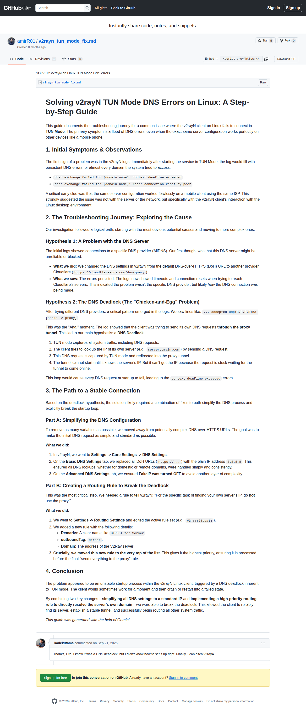

# Visited: https://gist.github.com/amirR01/ca50587dacbe2333695688951e9ee6a8
**Time:** Sat May  2 16:44:47 UTC 2026

## Screenshot

## Raw HTML
[page.html](./page.html)

## Downloaded Media (4 files)
## Downloaded Media Files

## Other Links
- [#1-initial-symptoms--observations](#1-initial-symptoms--observations)
- [#2-the-troubleshooting-journey-exploring-the-cause](#2-the-troubleshooting-journey-exploring-the-cause)
- [#3-the-path-to-a-stable-connection](#3-the-path-to-a-stable-connection)
- [#4-conclusion](#4-conclusion)
- [#file-v2rayn_tun_mode_fix-md](#file-v2rayn_tun_mode_fix-md)
- [#hypothesis-1-a-problem-with-the-dns-server](#hypothesis-1-a-problem-with-the-dns-server)
- [#hypothesis-2-the-dns-deadlock-the-chicken-and-egg-problem](#hypothesis-2-the-dns-deadlock-the-chicken-and-egg-problem)
- [#part-a-simplifying-the-dns-configuration](#part-a-simplifying-the-dns-configuration)
- [#part-b-creating-a-routing-rule-to-break-the-deadlock](#part-b-creating-a-routing-rule-to-break-the-deadlock)
- [#solving-v2rayn-tun-mode-dns-errors-on-linux-a-step-by-step-guide](#solving-v2rayn-tun-mode-dns-errors-on-linux-a-step-by-step-guide)
- [#start-of-content](#start-of-content)
- [/](/)
- [/amirR01](/amirR01)
- [/amirR01.atom](/amirR01.atom)
- [/amirR01/ca50587dacbe2333695688951e9ee6a8](/amirR01/ca50587dacbe2333695688951e9ee6a8)
- [/amirR01/ca50587dacbe2333695688951e9ee6a8/comments/5767903/edit_form?textarea_id=gistcomment-5767903-body&amp;comment_context=discussion](/amirR01/ca50587dacbe2333695688951e9ee6a8/comments/5767903/edit_form?textarea_id=gistcomment-5767903-body&amp;comment_context=discussion)
- [/amirR01/ca50587dacbe2333695688951e9ee6a8/raw/f37bf5d226c2f0265e628760d4afdaeabe49f670/v2rayn_tun_mode_fix.md](/amirR01/ca50587dacbe2333695688951e9ee6a8/raw/f37bf5d226c2f0265e628760d4afdaeabe49f670/v2rayn_tun_mode_fix.md)
- [/amirR01/ca50587dacbe2333695688951e9ee6a8/revisions](/amirR01/ca50587dacbe2333695688951e9ee6a8/revisions)
- [/amirR01/ca50587dacbe2333695688951e9ee6a8/stargazers](/amirR01/ca50587dacbe2333695688951e9ee6a8/stargazers)
- [/amirR01/ca50587dacbe2333695688951e9ee6a8?permalink_comment_id=5767903#gistcomment-5767903](/amirR01/ca50587dacbe2333695688951e9ee6a8?permalink_comment_id=5767903#gistcomment-5767903)
- [/discover](/discover)
- [/join?return_to=https%3A%2F%2Fgist.github.com%2FamirR01%2Fca50587dacbe2333695688951e9ee6a8&amp;source=header-gist](/join?return_to=https%3A%2F%2Fgist.github.com%2FamirR01%2Fca50587dacbe2333695688951e9ee6a8&amp;source=header-gist)
- [/join?source=comment-gist](/join?source=comment-gist)
- [/kadekutama](/kadekutama)
- [/login?return_to=https%3A%2F%2Fgist.github.com%2FamirR01%2Fca50587dacbe2333695688951e9ee6a8](/login?return_to=https%3A%2F%2Fgist.github.com%2FamirR01%2Fca50587dacbe2333695688951e9ee6a8)
- [/opensearch-gist.xml](/opensearch-gist.xml)
- [https://avatars.githubusercontent.com](https://avatars.githubusercontent.com)
- [https://avatars.githubusercontent.com/u/21980197?s=80&amp;v=4](https://avatars.githubusercontent.com/u/21980197?s=80&amp;v=4)
- [https://avatars.githubusercontent.com/u/78862582?s=64&amp;v=4](https://avatars.githubusercontent.com/u/78862582?s=64&amp;v=4)
- [https://desktop.github.com](https://desktop.github.com)
- [https://docs.github.com/](https://docs.github.com/)
- [https://docs.github.com/articles/which-remote-url-should-i-use](https://docs.github.com/articles/which-remote-url-should-i-use)
- [https://docs.github.com/site-policy/github-terms/github-terms-of-service](https://docs.github.com/site-policy/github-terms/github-terms-of-service)
- [https://docs.github.com/site-policy/privacy-policies/github-privacy-statement](https://docs.github.com/site-policy/privacy-policies/github-privacy-statement)
- [https://gist.github.com/auth/github?return_to=https%3A%2F%2Fgist.github.com%2FamirR01%2Fca50587dacbe2333695688951e9ee6a8](https://gist.github.com/auth/github?return_to=https%3A%2F%2Fgist.github.com%2FamirR01%2Fca50587dacbe2333695688951e9ee6a8)
- [https://github-cloud.s3.amazonaws.com](https://github-cloud.s3.amazonaws.com)
- [https://github.com](https://github.com)
- [https://github.com/security](https://github.com/security)
- [https://github.community/](https://github.community/)
- [https://github.githubassets.com](https://github.githubassets.com)
- [https://github.githubassets.com/](https://github.githubassets.com/)
- [https://github.githubassets.com/assets/2498-f0375ed070e22e54.js](https://github.githubassets.com/assets/2498-f0375ed070e22e54.js)
- [https://github.githubassets.com/assets/26533-f22c29ae5e9b1ed2.js](https://github.githubassets.com/assets/26533-f22c29ae5e9b1ed2.js)
- [https://github.githubassets.com/assets/28839-7adfdde5afeb1a03.js](https://github.githubassets.com/assets/28839-7adfdde5afeb1a03.js)
- [https://github.githubassets.com/assets/2887-91b9c645d570616a.js](https://github.githubassets.com/assets/2887-91b9c645d570616a.js)
- [https://github.githubassets.com/assets/29534-46ab69992248a8d7.js](https://github.githubassets.com/assets/29534-46ab69992248a8d7.js)
- [https://github.githubassets.com/assets/2966-d68f2b4558d86113.js](https://github.githubassets.com/assets/2966-d68f2b4558d86113.js)
- [https://github.githubassets.com/assets/34646-4c7883eb242d5210.js](https://github.githubassets.com/assets/34646-4c7883eb242d5210.js)
- [https://github.githubassets.com/assets/37460-fcd4830a1194eace.js](https://github.githubassets.com/assets/37460-fcd4830a1194eace.js)
- [https://github.githubassets.com/assets/41013-647932573fc130af.js](https://github.githubassets.com/assets/41013-647932573fc130af.js)

## Stats
- Links: 114
- Media: 4
